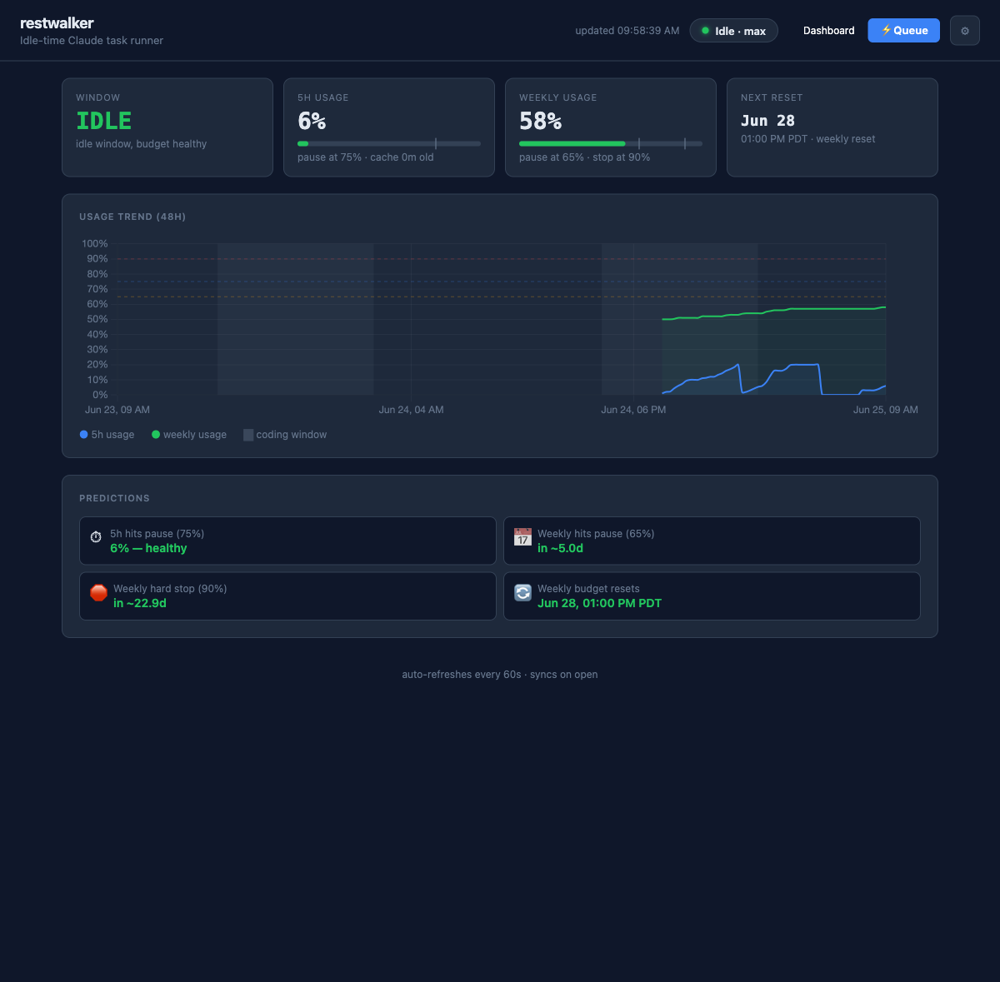

# restwalker

> Your Max plan's tokens refill on a clock and expire unused. RestWalker spends the leftovers on
> the work you keep meaning to get to.

Anthropic's models are powerful and the **Max plan is a real monthly cost** — but its quota refills
in rolling windows (5-hour and weekly), and most cycles you never burn through it before the next
one resets. That capacity you already paid for just evaporates. **RestWalker reclaims it:** a Mac
background service that runs Claude Code agent tasks during your idle time, gated by live usage so
it only ever spends quota you weren't going to use — and never eats into your interactive budget.

**What it does**

- **Defer in a word.** Mid-flow you spot something important but not urgent — just say
  *"have restwalker do this tonight."* It captures a self-contained task and runs it when things
  are quiet.
- **Results you can actually use.** Tasks declare the **artifacts** they produce and can generate
  ready-to-install **skills**, packaged so the output is easy to read, review, and reuse — not a
  wall of transcript to dig through.
- **Teleport.** Carry a recent conversation over from another folder — or another Mac running
  restwalker — when you started Claude in the wrong project, or switched computers.

Runs as a LaunchAgent on port **47290** with a SQLite database, a dashboard UI, a REST API
(OpenAPI 3.0), and an MCP server for Claude Code.



## Quick start

```bash
npm install -g @agentmessier/restwalker   # the CLI
restwalker install                         # daemon (LaunchAgent) — the plugin below wires up the MCP
```

Then, in Claude Code, add the plugin:

```
/plugin marketplace add agentmessier-ai/restwalker-app
/plugin install restwalker@restwalker
```

That's the whole setup. From here you **just talk to Claude Code** — nothing to memorize, no
dashboard required:

| Say something like… | What happens |
|---|---|
| *"have restwalker do this tonight: …"* | queues an important-but-not-urgent task for idle time |
| *"what's in my queue?"* · *"how much budget left?"* | status + next idle window |
| *"what did last night's task produce?"* | the result + its artifacts/files |
| *"what was I doing in `myproject`?"* · *"pull the conversation from my other Mac"* | teleport |

The dashboard at **http://localhost:47290** is **optional** — open it to watch usage/gates or tweak
thresholds. Everything below is reference; day to day, the line above is all you need.

## How it works

1. You add tasks to the queue (via dashboard, REST API, or MCP tools in Claude Code)
2. The gate checks live Claude usage from `api.anthropic.com` — Claude tracks your token spend in rolling 5-hour and weekly windows
3. **All gates must be open simultaneously** for a task to run — coding window, 5h budget, and weekly budget
4. Sessions are recorded; results, token counts, reasoning blocks, and transcripts are stored per task

### Budget gates (all configurable)

| Gate | Default | Behaviour |
|---|---|---|
| Coding window | disabled | Optional — enable in Settings to pause during a set time range each day |
| 5h rolling usage | ≥ 75% | Pause to protect your interactive budget |
| Weekly ceiling | ≥ 65% | Pause background jobs |
| Weekly hard stop | ≥ 90% | Hard stop regardless |

## Install

> Most people want the **Quick start** above (npm + plugin). This section is the from-source
> install and the Node/host/port options.

**Requirements:** macOS, Node.js 20+, Claude Code CLI (`claude login` must have been run — restwalker reads your credentials from the macOS Keychain)

```bash
git clone https://github.com/agentmessier-ai/restwalker-app.git
cd restwalker
./install.sh
```

The installer:
- Installs Node dependencies
- Installs and starts the LaunchAgent (auto-restarts on login)
- Points you to the plugin (which provides the MCP + skills); no standalone MCP is auto-registered, so there's nothing to un-pick later

Open `http://localhost:47290` to confirm it's running.

### Custom Node path

```bash
NODE=/opt/homebrew/bin/node ./install.sh
```

### Host & port

restwalker binds **`127.0.0.1:47290`** by default — localhost only. Because tasks can run
arbitrary shell commands (the `Bash` tool), the service is deliberately **not** reachable
from your network unless you opt in.

Set them at install time:

```bash
HOST=0.0.0.0 PORT=8080 ./install.sh    # expose on the LAN, custom port
```

Or change an existing install by editing the `HOST` / `PORT` keys in the LaunchAgent plist
and reloading:

```bash
# ~/Library/LaunchAgents/com.restwalker.plist  →  EnvironmentVariables
#   <key>HOST</key><string>0.0.0.0</string>
#   <key>PORT</key><string>8080</string>
launchctl unload ~/Library/LaunchAgents/com.restwalker.plist
launchctl load   ~/Library/LaunchAgents/com.restwalker.plist
```

> ⚠️ `HOST=0.0.0.0` exposes a Bash-capable service to every device on your network. Only do
> this on a trusted network. There is no built-in auth — put it behind a reverse proxy /
> firewall if you need remote access.

Host and port are **boot-time** settings: a running server can't rebind its socket, so a
change only takes effect after the reload above (and if you changed the port, reopen the
dashboard on the new one).

## Dashboard (optional)

`http://localhost:47290` — for when you want to *see* things or tune them; you can run RestWalker
entirely from chat without ever opening it.

- Live gate status, 5h and weekly usage, next window
- 48h trend chart with threshold overlays and coding-window shading
- Task queue: add, paginate, expand rows to view session transcripts and reasoning blocks
- Agent providers: configure which CLI runs tasks (a provider is a command template like `claude --print {{task}}`)
- Settings: all thresholds configurable without restart

## Task queue

Tasks have a description (the prompt), an optional working directory, model, provider, and schedule:

| Schedule | Behaviour |
|---|---|
| `once` | Runs once when the gate opens |
| `hourly` / `daily` / `weekly` / `monthly` | Automatically re-queues after each run |

The queue has two sections: **one-time tasks** at the top, **recurring tasks** below. Recurring tasks group all runs under a single entry showing run count, last run time, and execution duration.

Each task also supports (in the form's "Advanced" section, the Edit & Re-queue panel, the API, and MCP):

- **Task timeout** (`timeout_s`, seconds) — kill the agent if it runs longer; prefilled from the global default. Long research tasks should raise it.
- **Webhooks** — `webhook_pre_url` / `webhook_post_url` get a JSON POST before and after the run (with status, tokens, result). Useful for Slack/Discord notifications or chaining. Failures are logged, never abort the task.

Timeouts everywhere are in **seconds**. A failed recurring run still schedules its next occurrence, so one transient failure doesn't kill a daily task.

### Adding tasks (just ask)

The easy path is the plugin skill — in Claude Code, say:

```
have restwalker do this tonight: <what you want done>
```

`/restwalker:defer` turns that into a self-contained task and queues it. You don't name tools or
fill a form. (Without the plugin, *"use the restwalker MCP to add a task…"* calls `queue_add`
directly; the dashboard form and REST API work too — they're just more steps.)

### Example tasks

The [`examples/tasks/`](examples/tasks/) directory ships reference recurring tasks you can
copy and schedule:

| Example | Schedule | What it does |
|---|---|---|
| [**Dream Journal**](examples/tasks/dream-journal.md) | `daily` | Reflects on the last 24h of Claude Code conversations, distills reusable **skills**, scans the web + GitHub trending for better practices, and writes one markdown report as an artifact. The canonical "good recurring task": reads local context, uses tools, produces a single artifact, and only runs during your idle window. |

The **Dream Journal** is **seeded into the queue on a fresh install** as a scheduled daily
task — so a new install has a working recurring task out of the box. It runs on idle budget
(the gate controls timing) and you can delete it anytime. The other examples are copy-paste
reference: take the prompt, set the schedule, and queue it when you want it.

## Task workspace

Every task gets its own workspace folder under `~/.restwalker/workspace/`:

- **One-time tasks:** `~/.restwalker/workspace/<id>-<slug>-<timestamp>/`
- **Recurring tasks:** `~/.restwalker/workspace/<origin-id>-<slug>/<timestamp>/` — a fixed base folder per task, with a timestamped subfolder per run

The agent's working directory is set to the workspace by default (override with a custom `cwd` if needed). Click **Open in Finder** in the task detail view to jump straight to the folder. Each run also writes its full output to a `logs/` subfolder (`stdout.log` / `stderr.log`), persisted even on failure.

## Versioned task prompts

Every task in the queue is a versioned prompt object. Open any completed or scheduled task, click **✎ Edit & Re-queue**, and you can:

- Edit the prompt in a full textarea
- Add a version label
- Change the schedule
- Save as a new version (full version history is shown in the panel)
- Check **Run now (bypass gate)** to run immediately, or leave unchecked to queue normally

Recurring tasks automatically use the latest prompt version on each run — edit the prompt once and all future runs pick it up.

## Artifacts

### Artifact protocol

Restwalker injects a preamble into every task prompt that tells the agent how to declare artifacts — files it creates that you should see. When the agent writes a report, a script, a skill, or any other output meant for you, it outputs a declaration line:

```
ARTIFACT: {"path": "/absolute/path/to/file", "description": "one-line description"}
```

Restwalker parses these declarations after each task and stores them in the database. They appear as clickable chips in the task detail view, each with a **📁** button that reveals the file in Finder.

### Artifact viewer

Clicking a chip opens a slide-in viewer with a **Download** button in the header:

- **Markdown** — rendered
- **HTML** — rendered in a sandboxed iframe
- **JSON** — pretty-printed
- **Text / code** — preformatted block

This works with any agent provider — the preamble is plain text injected into the prompt.

## Tags

Every task is auto-tagged by the agent. An always-on preamble (prepended to whatever
system prompt is active, so it can't be edited away) asks the agent to classify its work
with up to 3 short topic tags and emit one line:

```
TAGS: ["backend", "refactor", "testing"]
```

Restwalker parses that line after the run and stores the tags on the task. The dashboard
shows them as chips on each task and offers a **tag filter** in the queue toolbar — click a
chip or pick from the dropdown to filter. Via API: `GET /queue?tag=backend` filters, and
`GET /queue/tags` lists all tags with counts.

## System prompt

The system prompt injected into every task is versioned and editable. Click **📋 System prompt** in the Add Task section to open the editor. You can:

- Edit the prompt and save a new version
- Browse version history and restore any prior version
- Restore the built-in default at any time

## Agent providers

The default provider — **`claude -p`** — runs `claude --print --permission-mode auto --model {{model}} {{task}}` (loop type `claude_print`). You can add any provider with a custom command and args template using `{{task}}`, `{{model}}`, and `{{cwd}}` placeholders, and pick its **loop type**: `claude_print` (spawn the CLI, the pipe) or `claude_sdk` (Anthropic Messages API).

## MCP server

> **Reference — you don't call these by name.** The plugin skills (Quick start) translate plain
> requests into these tools; this list is for power use and integration.

The MCP server (`node/mcp.ts`) exposes 27 tools for Claude Code via stdio transport:

| Group | Tools |
|---|---|
| Status | `status`, `can_run`, `usage_history`, `sync` |
| Queue | `queue_stats`, `queue_list`, `queue_get`, `queue_add`, `queue_cancel`, `queue_force_run`, `queue_session`, `queue_artifacts` |
| Task prompts | `task_prompt_save`, `task_prompt_versions` |
| System prompt | `system_prompt_get`, `system_prompt_set` |
| Providers | `list_providers`, `add_provider`, `set_default_provider` |
| Discovery | `list_models`, `list_projects` |
| Settings | `get_settings`, `update_settings` |
| Teleport | `teleport`, `teleport_list`, `teleport_folders`, `teleport_handoff` |

`queue_add` and `task_prompt_save` derive their input schemas from the live OpenAPI spec at
startup — adding a field to the REST route surfaces it in the MCP tool automatically.

**If you installed the plugin (Quick start), the MCP is already wired up — skip this.**
Registering it standalone *and* enabling the plugin gives you **duplicate tools** in the menu;
pick one. To register standalone instead of using the plugin (advanced):

```bash
claude mcp add --scope user restwalker -- restwalker mcp
# or, without a global install (replace the path with your clone):
claude mcp add --scope user restwalker -- \
  node ~/dev/restwalker/node/node_modules/.bin/tsx ~/dev/restwalker/node/mcp.ts
```

## Claude Code plugin

A companion [Claude Code plugin](plugin/) turns natural language into RestWalker actions from
any chat — no dashboard needed. It bundles five skills (and the MCP server):

| Skill | Say something like |
|---|---|
| `/restwalker:defer` | "do this tonight", "defer this", "run X overnight" |
| `/restwalker:status` | "restwalker status", "what's in my queue", "how much budget left" |
| `/restwalker:result` | "what did last night's task produce", "show the dream journal" |
| `/restwalker:dream-journal` | "set up my nightly dream journal" |
| `/restwalker:teleport` | "what was I doing in `<project>`", "pull the conversation from my other Mac" |

```
/plugin marketplace add agentmessier-ai/restwalker-app
/plugin install restwalker@restwalker
```

See [`plugin/README.md`](plugin/README.md) for details.

## Teleport

Claude Code ties each conversation to the folder it ran in, which bites when you're juggling
projects or machines — you started Claude in the **wrong folder**, or began on **another Mac**,
and the thread you want is stranded elsewhere. Teleport carries it over for continuity: name a
folder and a time window and it pulls that recent conversation into your current session — from
this Mac, or from another Mac on your LAN. Just ask the agent.

- **Same Mac, other folder** — *"what was I doing in `myproject`"* → pulls the recent turns from
  that folder's Claude session.
- **Another Mac** — *"pull the agentnet conversation from my other Mac"* → the agent scans your
  LAN for the peer, confirms it, and pulls the conversation directly.

Teleport is **read-only** and works through the MCP tools (`teleport`, `teleport_list`,
`teleport_folders`) and the `/restwalker:teleport` skill — no dashboard needed to use it.

**To be a _source_** (the Mac you pull *from*): Settings → Teleport → **Advertise on LAN**, and
bind the daemon to `0.0.0.0` (`HOST` in the LaunchAgent). The Mac you pull *to* needs no setup.
On a trusted LAN no token is required (access is guarded to private IPs); set a **pairing token**
on both Macs for authenticated access.

> macOS denies the background daemon access to the local network, so cross-Mac pulls run through
> the agent's own shell (which holds Local-Network permission) rather than the daemon. See
> [`docs/teleport-design.md`](docs/teleport-design.md) for the full architecture.

## API

Full OpenAPI 3.0 spec and interactive docs at **`http://localhost:47290/docs`**.

Key endpoints:

| Endpoint | Method | Description |
|---|---|---|
| `/queue` | GET | List tasks (filter by status, schedule type, **tag**, sort) |
| `/queue` | POST | Add a task |
| `/queue/tags` | GET | Distinct task tags with usage counts |
| `/queue/:id` | GET | Get a single task |
| `/queue/:id/force-run` | POST | Force-run bypassing the gate |
| `/queue/:id/session` | GET | Session transcript with thinking blocks |
| `/queue/:id/artifacts` | GET | List artifacts declared by a task |
| `/queue/origin/:id/runs` | GET | Run history for a recurring task chain |
| `/artifacts/:id/content` | GET | Raw artifact file content |
| `/task-prompts` | POST | Create a versioned task prompt and optionally queue it |
| `/task-prompts/:id/versions` | POST | Save a new version of an existing prompt |
| `/task-prompts/:id/versions` | GET | List all versions in a prompt chain |
| `/system-prompt` | GET/POST | Read or update the active system prompt |
| `/system-prompt/restore-builtin` | POST | Restore to the built-in default |
| `/open-folder` | POST | Open a folder in Finder, or reveal a file (`reveal: true`) |
| `/queue/stats` | GET | Counts by status |
| `/providers` | GET/POST | List or add agent providers |
| `/models` | GET | Live Anthropic model list |
| `/projects` | GET | Claude Code projects from history |
| `/status` | GET | Full daemon state |
| `/can-run` | GET | Quick gate check |
| `/settings` | GET/POST | Read or update thresholds |
| `/healthz` | GET | `{ok: true}` |

## Files

| Path | Purpose |
|---|---|
| `node/app.ts` | Fastify app, OpenAPI spec, all routes |
| `node/db.ts` | Drizzle ORM repositories (tasks, prompts, providers, artifacts, system prompt, settings, snapshots) |
| `node/schema.ts` | Drizzle table definitions — single source of truth |
| `node/runner.ts` | better-queue worker, provider resolution, gate logic, workspace path generation |
| `node/scheduler.ts` | Keychain read, Anthropic API fetch, time gate, budget logic |
| `node/session.ts` | Session JSONL parser, analysis, artifact extraction |
| `node/mime.ts` | Mime-type lookup helper (no external dependency) |
| `node/mcp.ts` | MCP server (stdio, 23 tools) |
| `index.html` | Dashboard UI (no build step, hash-based routing) |
| `plugin/` | Claude Code plugin — skills + bundled MCP server |
| `examples/tasks/` | Reference recurring tasks (e.g. the Dream Journal) |
| `install.sh` | One-command installer with interactive MCP registration |
| `uninstall.sh` | Clean removal |

## Data

All data lives in `~/.restwalker/`:

| Path | Contents |
|---|---|
| `restwalker.db` | SQLite database (tasks, prompts, artifacts, providers, settings, usage snapshots) |
| `restwalker.log` | Daemon log |
| `queue.db` | better-queue persistence |
| `workspace/` | Task workspace folders |

```bash
tail -f ~/.restwalker/restwalker.log
```

## Uninstall

```bash
./uninstall.sh
```

It removes everything the installer set up:

- stops the service + removes the LaunchAgent (`~/Library/LaunchAgents/com.restwalker.plist`)
- removes any standalone `restwalker` MCP registration from Claude Code (best-effort)

Your **data is kept by default** — `~/.restwalker/` (the DB, logs, and your task
`workspace/` artifacts) is only deleted if you confirm the prompt. The script also reminds you to
remove the plugin in Claude Code (`/plugin uninstall restwalker@restwalker`) and to delete the app
directory if you cloned it.

## Acknowledgements

- [**ccstatusline**](https://github.com/sirmalloc/ccstatusline) — inspired the idea behind RestWalker.
- [**pi**](https://github.com/earendil-works/pi) — its artifact module inspired RestWalker's approach to artifacts.
